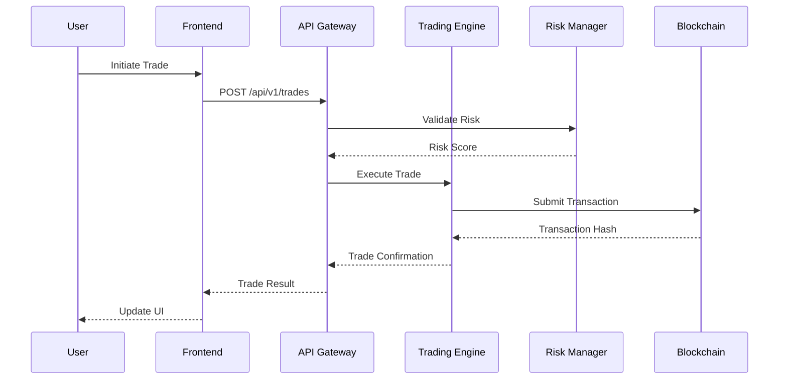
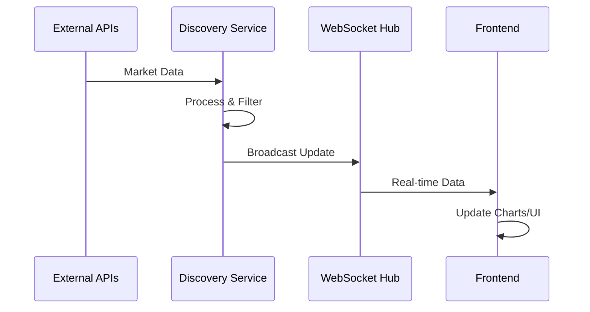

# System Architecture

## 🏗️ Overview

DEX Sniper Pro is a professional-grade decentralized exchange trading platform built with a modern, scalable architecture. The system follows a microservices-inspired design with clear separation of concerns, enabling high performance, reliability, and maintainability.

## 📊 Architecture Diagram

```
┌─────────────────────────────────────────────────────────────────┐
│                        Frontend Layer                           │
├─────────────────────────────────────────────────────────────────┤
│  React + Vite + Bootstrap 5                                     │
│  ├── Trading Interface     ├── Portfolio Dashboard              │
│  ├── Risk Management       ├── Analytics & Reporting            │
│  ├── AI Features          ├── Settings & Configuration          │
│  └── WebSocket Client     └── PWA Support                       │
└─────────────────────────────────────────────────────────────────┘
                                    │
                              WebSocket/HTTP
                                    │
┌─────────────────────────────────────────────────────────────────┐
│                     API Gateway Layer                           │
├─────────────────────────────────────────────────────────────────┤
│  FastAPI + Uvicorn                                              │
│  ├── Authentication       ├── Rate Limiting                     │
│  ├── Request Validation   ├── Error Handling                    │
│  ├── CORS Management      ├── API Documentation                 │
│  └── WebSocket Hub       └── Health Monitoring                  │
└─────────────────────────────────────────────────────────────────┘
                                    │
                            Internal Services
                                    │
┌─────────────────────────────────────────────────────────────────┐
│                     Core Services Layer                         │
├─────────────────────────────────────────────────────────────────┤
│ ┌───────────────┐ ┌───────────────┐ ┌───────────────┐          │
│ │ Trading Engine│ │ Risk Manager  │ │ Discovery     │          │
│ │ - Quote Gen   │ │ - Scoring     │ │ - Pair Monitor│          │
│ │ - Execution   │ │ - Validation  │ │ - WebSocket   │          │
│ │ - Orders      │ │ - Limits      │ │ - Events      │          │
│ └───────────────┘ └───────────────┘ └───────────────┘          │
│                                                                 │
│ ┌───────────────┐ ┌───────────────┐ ┌───────────────┐          │
│ │ AI Systems    │ │ Portfolio Mgmt│ │ Simulation    │          │
│ │ - Auto-tuning │ │ - Tracking    │ │ - Backtesting │          │
│ │ - Risk AI     │ │ - Analytics   │ │ - Modeling    │          │
│ │ - Anomaly Det │ │ - Reporting   │ │ - Validation  │          │
│ └───────────────┘ └───────────────┘ └───────────────┘          │
└─────────────────────────────────────────────────────────────────┘
                                    │
                          Adapter Interfaces
                                    │
┌─────────────────────────────────────────────────────────────────┐
│                   Blockchain Layer                              │
├─────────────────────────────────────────────────────────────────┤
│ ┌─────────────┐ ┌─────────────┐ ┌─────────────┐ ┌─────────────┐│
│ │  Ethereum   │ │     BSC     │ │   Polygon   │ │   Solana    ││
│ │ ┌─────────┐ │ │ ┌─────────┐ │ │ ┌─────────┐ │ │ ┌─────────┐ ││
│ │ │Uniswap  │ │ │ │PancakeS │ │ │ │QuickSwap│ │ │ │ Jupiter │ ││
│ │ │ v2/v3   │ │ │ │   v2    │ │ │ │   v2    │ │ │ │         │ ││
│ │ └─────────┘ │ │ └─────────┘ │ │ └─────────┘ │ │ └─────────┘ ││
│ └─────────────┘ └─────────────┘ └─────────────┘ └─────────────┘│
└─────────────────────────────────────────────────────────────────┘
                                    │
                            External Services
                                    │
┌─────────────────────────────────────────────────────────────────┐
│                   External APIs Layer                           │
├─────────────────────────────────────────────────────────────────┤
│ ┌─────────────┐ ┌─────────────┐ ┌─────────────┐ ┌─────────────┐│
│ │ DexScreener │ │  CoinGecko  │ │  0x/1inch   │ │   Alerts    ││
│ │ - Discovery │ │ - Prices    │ │ - Routing   │ │ - Email     ││
│ │ - Analytics │ │ - Market    │ │ - Quotes    │ │ - Telegram  ││
│ └─────────────┘ └─────────────┘ └─────────────┘ └─────────────┘│
└─────────────────────────────────────────────────────────────────┘
                                    │
                              Data Layer
                                    │
┌─────────────────────────────────────────────────────────────────┐
│                     Data Storage Layer                          │
├─────────────────────────────────────────────────────────────────┤
│ ┌─────────────┐ ┌─────────────┐ ┌─────────────┐ ┌─────────────┐│
│ │  SQLite DB  │ │    Logs     │ │   Backups   │ │    Cache    ││
│ │ - WAL Mode  │ │ - JSON      │ │ - Archives  │ │ - Redis     ││
│ │ - Relations │ │ - Rotation  │ │ - Restore   │ │ - Memory    ││
│ └─────────────┘ └─────────────┘ └─────────────┘ └─────────────┘│
└─────────────────────────────────────────────────────────────────┘
```

## 🔧 Core Components

### Frontend Architecture

**Technology Stack**:
- **React 18**: Modern UI framework with hooks and concurrent features
- **Vite**: Fast build tool and development server
- **Bootstrap 5**: Responsive design framework
- **Chart.js**: Advanced charting for analytics
- **WebSocket**: Real-time data connections

**Key Features**:
- **Component-based Architecture**: Reusable, maintainable components
- **State Management**: Context API and local state for optimal performance
- **Real-time Updates**: WebSocket integration for live data
- **Progressive Web App**: Offline capabilities and mobile optimization
- **Responsive Design**: Works seamlessly across devices

### Backend Architecture

**Technology Stack**:
- **FastAPI**: Modern, fast web framework for building APIs
- **Uvicorn**: Lightning-fast ASGI server
- **SQLAlchemy**: Advanced ORM with async support
- **Pydantic**: Data validation and serialization
- **AsyncIO**: Asynchronous programming for high performance

**Design Patterns**:
- **Repository Pattern**: Clean data access abstraction
- **Service Layer**: Business logic separation
- **Dependency Injection**: Loose coupling and testability
- **Factory Pattern**: Dynamic component creation
- **Observer Pattern**: Event-driven architecture

## 🏛️ Service Architecture

### 1. Trading Engine
```python
┌─────────────────────────────────────┐
│           Trading Engine            │
├─────────────────────────────────────┤
│ ┌─────────────┐ ┌─────────────────┐ │
│ │ Quote Mgr   │ │ Execution Mgr   │ │
│ │ - Routing   │ │ - Validation    │ │
│ │ - Pricing   │ │ - Submission    │ │
│ │ - Caching   │ │ - Monitoring    │ │
│ └─────────────┘ └─────────────────┘ │
│ ┌─────────────┐ ┌─────────────────┐ │
│ │ Order Mgr   │ │ Position Mgr    │ │
│ │ - Lifecycle │ │ - Tracking      │ │
│ │ - Triggers  │ │ - Updates       │ │
│ │ - Execution │ │ - Analytics     │ │
│ └─────────────┘ └─────────────────┘ │
└─────────────────────────────────────┘
```

### 2. Risk Management System
```python
┌─────────────────────────────────────┐
│         Risk Management             │
├─────────────────────────────────────┤
│ ┌─────────────┐ ┌─────────────────┐ │
│ │ Risk Scorer │ │ Limit Manager   │ │
│ │ - Analysis  │ │ - Position      │ │
│ │ - Scoring   │ │ - Daily         │ │
│ │ - History   │ │ - Emergency     │ │
│ └─────────────┘ └─────────────────┘ │
│ ┌─────────────┐ ┌─────────────────┐ │
│ │ Validator   │ │ Circuit Breaker │ │
│ │ - Pre-trade │ │ - Monitoring    │ │
│ │ - Real-time │ │ - Auto-stop     │ │
│ │ - Post-trade│ │ - Recovery      │ │
│ └─────────────┘ └─────────────────┘ │
└─────────────────────────────────────┘
```

### 3. AI Systems
```python
┌─────────────────────────────────────┐
│            AI Systems               │
├─────────────────────────────────────┤
│ ┌─────────────┐ ┌─────────────────┐ │
│ │ Auto-tuner  │ │ Risk Explainer  │ │
│ │ - Bayesian  │ │ - NLP Analysis  │ │
│ │ - Optimize  │ │ - Templates     │ │
│ │ - Learning  │ │ - Context       │ │
│ └─────────────┘ └─────────────────┘ │
│ ┌─────────────┐ ┌─────────────────┐ │
│ │ Anomaly Det │ │ Decision Journal│ │
│ │ - Patterns  │ │ - Insights      │ │
│ │ - Alerts    │ │ - Learning      │ │
│ │ - ML Models │ │ - Bias Detect   │ │
│ └─────────────┘ └─────────────────┘ │
└─────────────────────────────────────┘
```

## 🔄 Data Flow

### Trade Execution Flow


### Real-time Data Flow


## 🗄️ Database Design

### Schema Overview
```sql
-- Core Trading Tables
trades ←→ positions ←→ orders
   ↓         ↓          ↓
quotes    portfolio  triggers
   ↓         ↓          ↓
tokens    analytics ledger

-- Supporting Tables
presets → configurations
users → sessions → auth
logs → monitoring → alerts
```

### Key Relationships
- **One-to-Many**: User → Trades, Trades → Orders
- **Many-to-Many**: Tokens ↔ Pairs, Strategies ↔ Presets  
- **One-to-One**: Trade → Quote, Position → Analytics

## 🚀 Performance Architecture

### Caching Strategy
```python
┌─────────────────────────────────────┐
│           Caching Layers            │
├─────────────────────────────────────┤
│ L1: Memory Cache (10s-1m)           │
│ ├── Active Quotes                   │
│ ├── Token Metadata                  │
│ └── User Sessions                   │
├─────────────────────────────────────┤
│ L2: Redis Cache (1m-1h)             │
│ ├── Historical Data                 │
│ ├── Analytics Results               │
│ └── AI Model Outputs                │
├─────────────────────────────────────┤
│ L3: Database Cache (1h+)            │
│ ├── Token Information               │
│ ├── Trading History                 │
│ └── Configuration Data              │
└─────────────────────────────────────┘
```

### Concurrency Model
- **AsyncIO**: Non-blocking I/O for high throughput
- **Connection Pooling**: Efficient database access
- **Rate Limiting**: Prevent API abuse
- **Queue Management**: Background task processing
- **Resource Pools**: Reusable connections and objects

## 🔐 Security Architecture

### Security Layers
```python
┌─────────────────────────────────────┐
│          Security Stack             │
├─────────────────────────────────────┤
│ Application Security                │
│ ├── Input Validation                │
│ ├── Output Encoding                 │
│ ├── SQL Injection Prevention        │
│ └── XSS Protection                  │
├─────────────────────────────────────┤
│ API Security                        │
│ ├── Authentication                  │
│ ├── Authorization                   │
│ ├── Rate Limiting                   │
│ └── CORS Control                    │
├─────────────────────────────────────┤
│ Infrastructure Security             │
│ ├── TLS Encryption                  │
│ ├── Secure Headers                  │
│ ├── Key Management                  │
│ └── Audit Logging                   │
└─────────────────────────────────────┘
```

### Wallet Security
- **Non-custodial Design**: Private keys never stored
- **Secure Communication**: Encrypted wallet connections
- **Permission Model**: Minimal required permissions
- **Approval Management**: Limited token approvals

## 📊 Monitoring & Observability

### Observability Stack
```python
┌─────────────────────────────────────┐
│        Observability Stack          │
├─────────────────────────────────────┤
│ Metrics Collection                  │
│ ├── Performance Metrics             │
│ ├── Business Metrics                │
│ ├── Error Rates                     │
│ └── Resource Usage                  │
├─────────────────────────────────────┤
│ Logging System                      │
│ ├── Structured JSON Logs            │
│ ├── Trace ID Correlation            │
│ ├── Log Aggregation                 │
│ └── Alert Integration               │
├─────────────────────────────────────┤
│ Health Monitoring                   │
│ ├── Service Health Checks           │
│ ├── Dependency Monitoring           │
│ ├── Circuit Breakers                │
│ └── Auto-recovery                   │
└─────────────────────────────────────┘
```

## 🔧 Deployment Architecture

### Environment Tiers
```python
┌─────────────────────────────────────┐
│         Environment Tiers           │
├─────────────────────────────────────┤
│ Production                          │
│ ├── Load Balancing                  │
│ ├── Auto-scaling                    │
│ ├── Monitoring                      │
│ └── Backup/Recovery                 │
├─────────────────────────────────────┤
│ Staging                             │
│ ├── Production Mirror               │
│ ├── Integration Testing             │
│ ├── Performance Testing             │
│ └── Security Scanning               │
├─────────────────────────────────────┤
│ Development                         │
│ ├── Local Development               │
│ ├── Unit Testing                    │
│ ├── Code Quality Checks             │
│ └── Rapid Iteration                 │
└─────────────────────────────────────┘
```

## 📈 Scalability Considerations

### Horizontal Scaling
- **Stateless Services**: Easy to replicate
- **Database Sharding**: Partition by user/time
- **CDN Integration**: Static asset delivery
- **Load Balancing**: Distribute traffic effectively

### Vertical Scaling
- **Resource Optimization**: Efficient algorithms
- **Memory Management**: Proper garbage collection
- **CPU Optimization**: Async processing
- **I/O Optimization**: Connection pooling

## 🎯 Design Principles

### 1. **Separation of Concerns**
- Clear boundaries between layers
- Single responsibility per component
- Minimal coupling between modules

### 2. **Fault Tolerance**
- Graceful degradation under load
- Circuit breaker pattern implementation
- Automatic retry with exponential backoff

### 3. **Security by Design**
- Security considerations in every component
- Principle of least privilege
- Defense in depth strategy

### 4. **Performance First**
- Optimized for low latency trading
- Efficient resource utilization
- Proactive performance monitoring

### 5. **Maintainability**
- Clean, documented code
- Comprehensive testing
- Modular architecture

---

## 📚 Related Documentation

- [Database Schema](database.md) - Detailed database design
- [API Documentation](../api/README.md) - Complete API reference
- [Security Architecture](security.md) - Security implementation details
- [Chain Integration](chains.md) - Blockchain integration architecture

---

*This architecture enables DEX Sniper Pro to handle high-frequency trading with enterprise-grade reliability and security.*